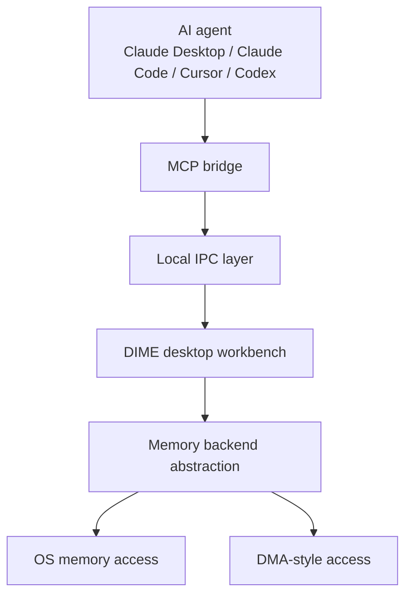
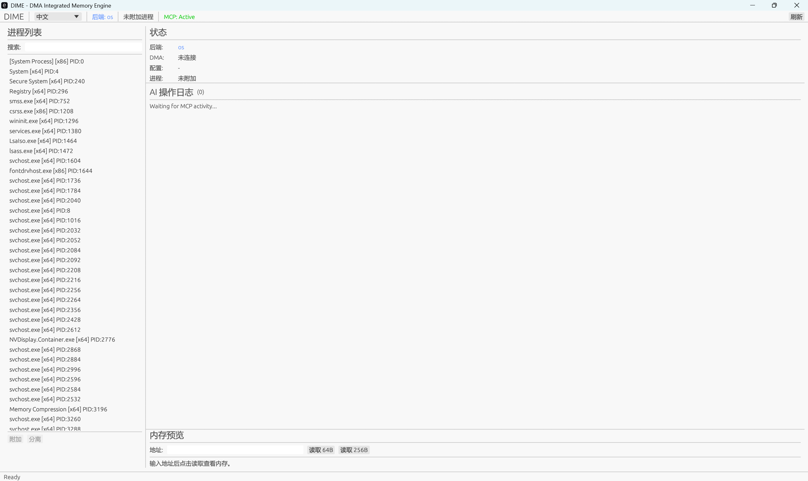

# DIME

**DMA Integrated Memory Engine** is a Windows-first memory analysis and reverse engineering workbench built for AI-assisted workflows.

This public repository is a **product showcase repo** for DIME.  
The core implementation, active development branch, and all private operational material remain in a separate private repository.

## What DIME Is

DIME is designed to connect modern AI agents with local memory tooling in a structured, repeatable way.

Instead of treating reverse engineering as a loose collection of manual steps, DIME turns the workflow into:

- structured tool calls
- live process inspection
- memory scanning and analysis
- repeatable operator workflows
- AI-readable results through MCP

## Why It Exists

Traditional reverse engineering and memory analysis tools are powerful, but they were not designed for AI-native interaction.

DIME closes that gap by combining:

- a local Windows memory engine
- MCP integration for AI tools
- a GUI workbench for operators
- a backend abstraction for both OS and DMA-style access
- reusable analysis workflows

## Core Product Idea

DIME is built around a single goal:

**make memory analysis accessible to AI agents without giving up operator visibility or backend flexibility.**

## Product Capabilities

- Process enumeration and attachment
- Module and thread inspection
- Memory read and write operations
- First-scan and next-scan workflows
- AOB pattern scanning
- Pointer chain resolution
- Disassembly and structure inspection
- Structured operator workflows
- AI tool integration through MCP
- Operator-visible logging and live state in the desktop UI

## Intended Workflow

1. Start the DIME desktop application locally.
2. Connect an AI client through MCP.
3. Ask the agent to inspect a process, scan memory, or assist with memory analysis tasks.
4. Watch tool calls and results appear in the operator UI.
5. Reuse the workflow in future sessions.

This workflow is especially useful for:

- AI-assisted reverse engineering
- memory debugging and structure inspection
- long-context AI-assisted analysis sessions

## Product Surface

The desktop workbench is designed around four operator-facing areas:

- Process selection
- Backend and attachment status
- AI operation log
- Memory preview

## Public Demo

The current public demo for DIME is the desktop application's main home page.

It shows the operator-facing workbench in its default attached-ready state, including:

- process list on the left
- backend and attachment status at the top
- AI operation log in the center
- memory preview controls at the bottom

## Demo Material

This repo is intended to host public-facing product material such as:

- screenshots of the desktop UI
- short product demo videos
- architecture diagrams
- onboarding notes
- public release notes

### Current Public Asset

- `assets/dime-application-homepage.png`

### Scope Note

This public repo intentionally does **not** include case studies, target-specific examples, or real operational walkthroughs.

## Public / Private Split

### Public in this repo

- product overview
- architecture at a high level
- capability summary
- screenshots and demo assets
- integration examples

### Kept private

- active source repository
- implementation details under active iteration
- private datasets and internal validation material
- any target-specific or case-specific information

## Integration Direction

DIME is designed to work alongside AI coding tools and local agent clients that support MCP-style tool calling.

Typical integration targets include:

- Claude Desktop
- Claude Code
- Cursor
- Codex

## Current Status

DIME is under active development as a serious product and workflow engine, not just a one-off demo.

The current public-facing material is intentionally minimal: one clean application home page screenshot plus a high-level product description. The private repo remains the main engineering workspace.

## Roadmap

- Publish additional screenshots and a short walkthrough video
- Add a polished public architecture diagram
- Publish integration examples for AI clients
- Share sanitized release notes and milestone updates
- Prepare a stable public demo package

## License

MIT. See [LICENSE](LICENSE).
